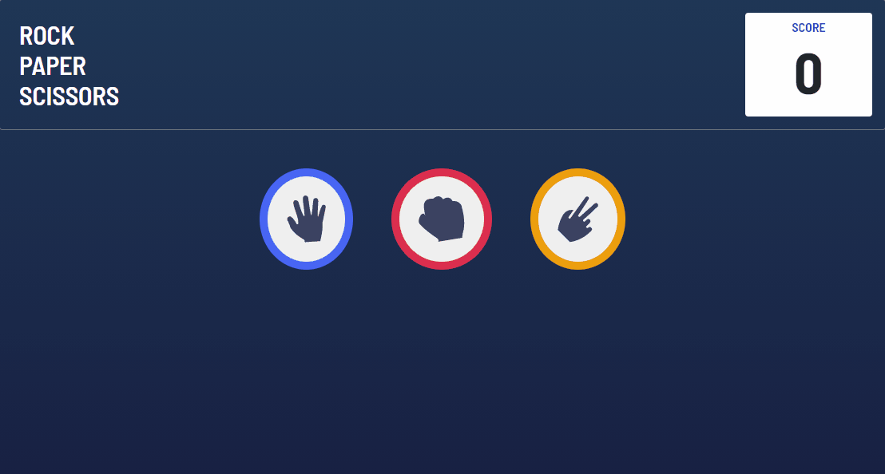

# README

<h1 align="center"> ROCK PAPER SCISSORS </h1>

 
    <a href="#sobre">Sobre</a>
    <a href="#funcionalidades">Funcionalidades</a>
    <a href="#tecnologias">Tecnologias</a>
    <a href="#Autor">Autor</a>
 

 # Sobre
 

 
Jogo de pedra, papel e tesoura criado com html, css e js

 
Você mesmo pode conferir o projeto clicando nesse <a href="https://yutaronegi.github.io/RockPaperScissors/">Link</a>

 
O site está 100% em inglês para treinar o meu desenvolvimento com projetos em inglês

 # Funcionalidades 
<ul>
    <li>Escolher entre pedra, papel e tesoura</li>
    <li>Jogar contra I.A</li>
    <li>Sistema de pontuação</li>
 </ul>

 # Tecnologias
 <ul>
    <li>HTML</li>
    <li>CSS</li>
    <li>Javascript</li>
    <li>Bootstrap</li>
 </ul>

 # Autor

 <ul>
    <li>Yutaro Negi</li>
    <li><a href="https://www.linkedin.com/in/yutaronegi/">Linkedin</a></li>
    <li>(11) 94194-5061</li>
    <li>souza_yutaro@hotmail.com</li>
 </ul>

